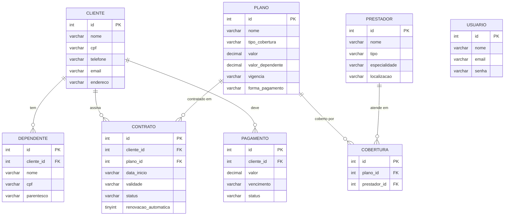

# DER — Modelo de Dados

Diagrama de Entidade e Relacionamento. Fonte versionável em Mermaid (renderiza no
GitHub). Para a entrega, exportar como PNG/PDF. Espelha `schema.sql`.

Relações:
- um **cliente** tem vários **dependentes**, **contratos** e **pagamentos**;
- um **plano** aparece em vários **contratos** e em várias **coberturas**;
- um **prestador** aparece em várias **coberturas** (vínculo plano × prestador);
- **usuario**: tabela de login, sem relações com o domínio.

