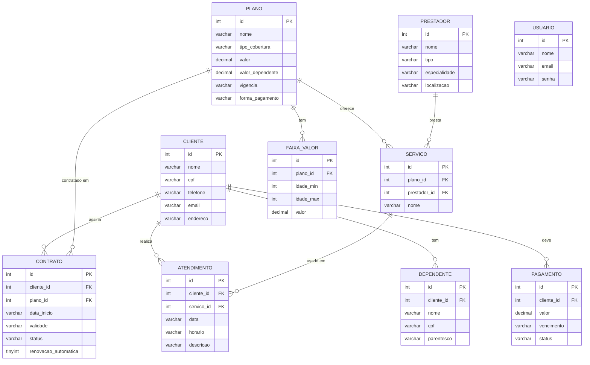

# DER — Modelo de Dados

Diagrama de Entidade e Relacionamento. Fonte versionável em Mermaid (renderiza no
GitHub). Para a entrega, exportar como PNG/PDF. Espelha `schema.sql`.

Relações:
- um **cliente** tem vários **dependentes**, **contratos** e **pagamentos**;
- um **cliente** também possui vários **atendimentos** no histórico;
- um **plano** aparece em vários **contratos**, **serviços** e **faixas de valor**;
- um **prestador** aparece em vários **serviços** (vínculo plano × prestador);
- um **serviço** aparece em vários **atendimentos**;
- **usuario**: tabela de login, sem relações com o domínio.

